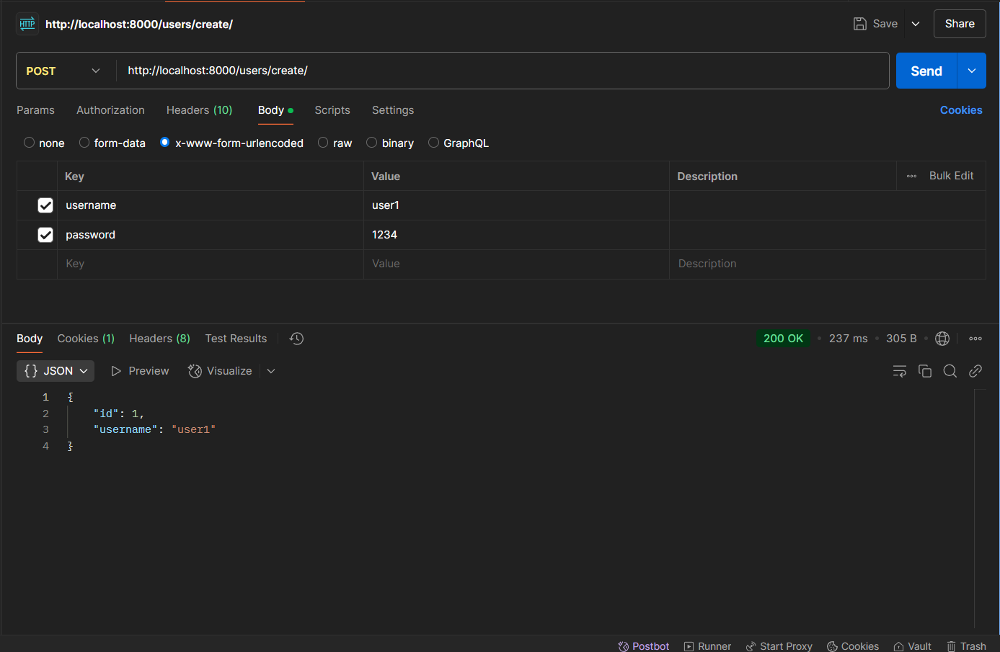
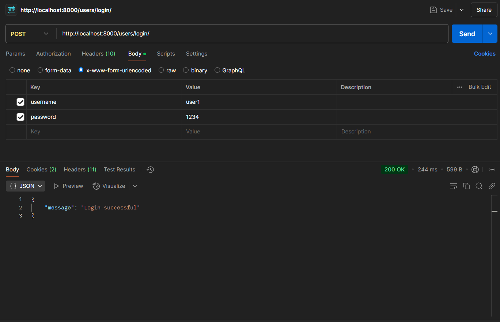
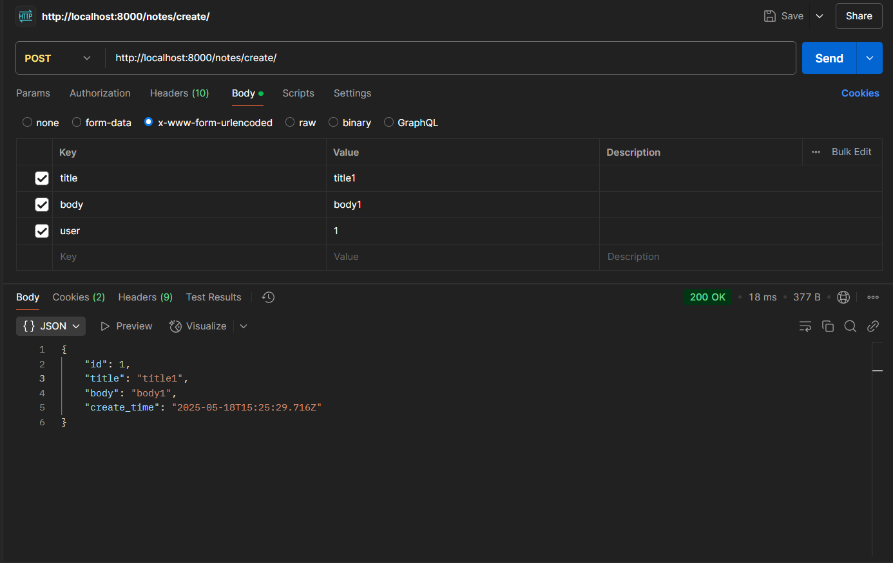
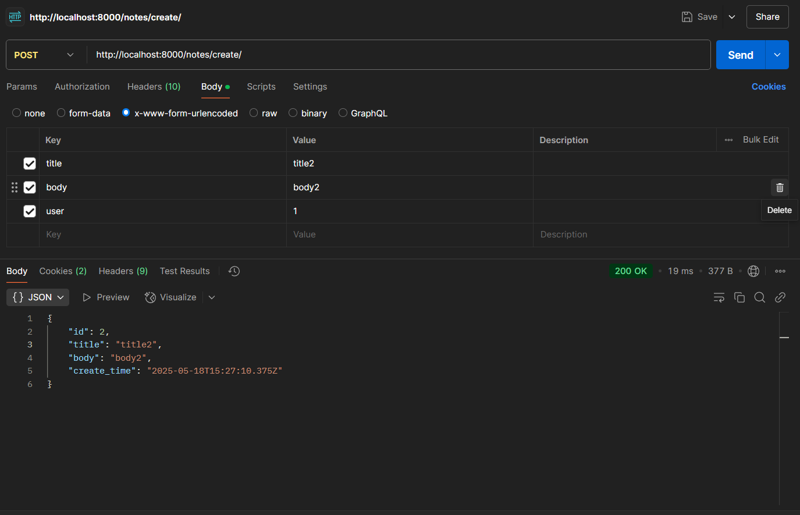
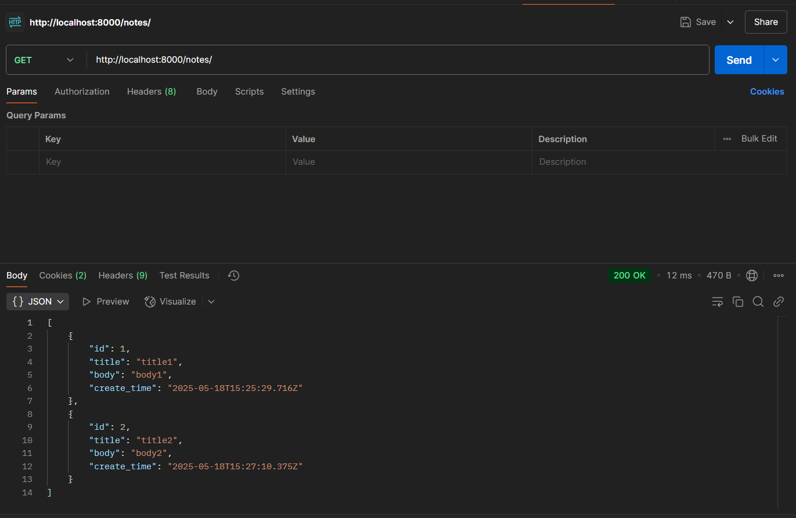
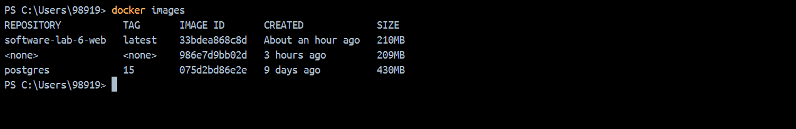
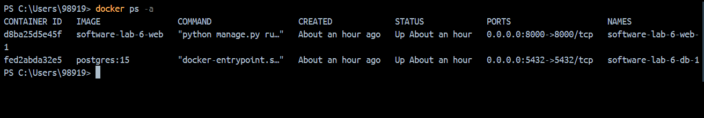
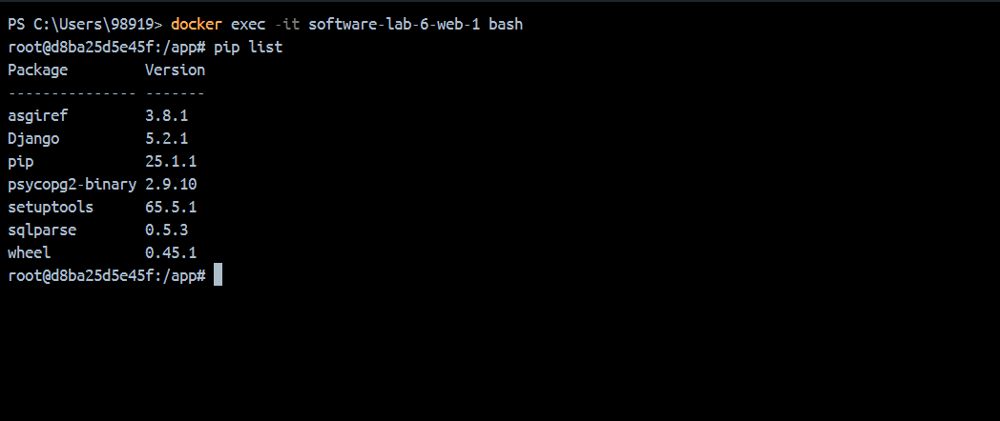

# اجرای سرویس‌ها

برای `build` کردن و اجرای سرویس‌ها از دستور زیر استفاده می کنیم:

```bash
docker-compose up --build
```
این دستور باعث ساخت ایمیج‌ها طبق تعریف docker-compose.yml و اجرای کانتینرهای مرتبط با آن می شود.


اکنون در `Docker Desktop`، درستی اجرا را بررسی می کنیم و باگ های احتمالی را آنالیز می کنیم:

## نمایش ایمیج‌ های ساخته‌ شده:

در تب `images` در `Docker Desktop` داریم:


## نمایش کانتینرهای در حال اجرا:

در تب `containers` در `Docker Desktop` داریم:


# ارسال درخواست به وب‌سرور

در این بخش هدف ما تعامل با وب‌سرور اجرا شده در `Docker` است تا مراحل زیر را از طریق ارسال درخواست‌های `HTTP` به کمک نرم افزار `postman` انجام دهیم:

## ساخت کاربر 

با ارسال `http request `  در نرم افزار `postman` و تنظیم متد آن روی `post`، و ارسال url مخصوص به ساخت کاربر`(http://localhost:8000/users/create)`، به تب `body`  و سپس تب `x-www-form-urlencoded`  می رویم و  `key` و `value` خود برای ایجاد کاربر جدید با نام کاربری `user1` و پسوورد `1234` را وارد کردیم:




همانطور که مشاهده می شود، `status=200`  نشان می دهد که کاربر ما به درستی ساخته شده است.


##    ساخت یادداشت برای کاربر 

به این منظور، ابتدا `login` می کنیم:



سپس یادداشت خواسته شده را ایجاد می کنیم:



و سپس یادداشت دوم :



## دریافت یادداشت های کاربر

برای دریافت یادداشت های کاربر، به کمک متد `GET` به آدرس URL  زیر می رویم:

`http://localhost:8000/notes/`

سپس مطابق شکل مشاهده می شود که کاربر دو یادداشت دارد:





# تعامل با داکر 

##  1-نمایش `image` ها و `container` ها 

ابتدا تمامی `image` ها را نمایش می دهیم:



که `image` مربوط به `software-lab-6-web` متعلق به پروژه ما می باشد.


سپس تمامی `container` ها را نمایش می دهیم:



که `container `های قابل مشاهده توسط پروژه ما ایجاد شده اند.

(مجددا  `software-lab-6-web` حاوی `container` متعلق به پروژه ما بوده است.)


##  اجرای یک دستور دلخواه در کانتینر وب‌سرور

ابتدا با دستور زیر وارد شل مخصوص کانتینر وب سرور می شویم:

```bash
docker exec -it software-lab-6-web-1 bash

```

سپس  برای نمایش پکیج های نصب شده در این کانتینر داریم:



که این دستور، لیست تمامی پکیج های نصب شده را باز می گرداند.