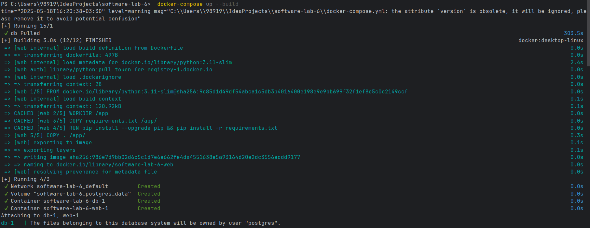
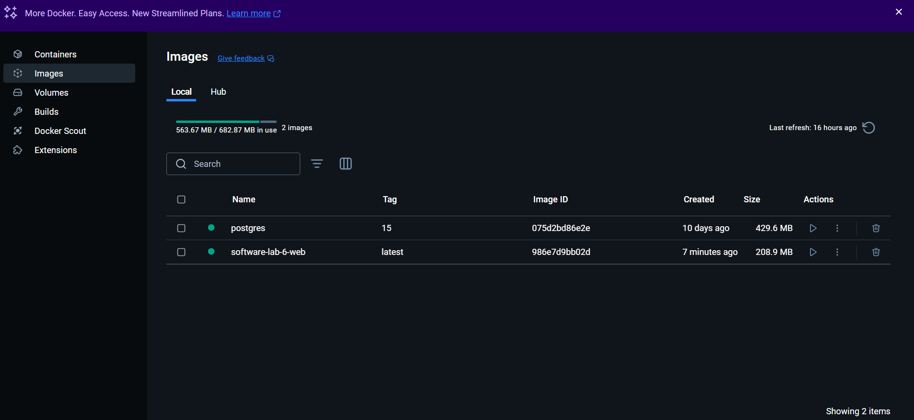
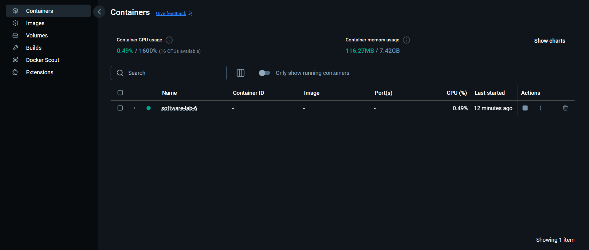

# اجرای سرویس‌ها

برای `build` کردن و اجرای سرویس‌ها از دستور زیر استفاده می کنیم:

```bash
docker-compose up --build
```
این دستور باعث ساخت ایمیج‌ها طبق تعریف docker-compose.yml و اجرای کانتینرهای مرتبط با آن می شود.




اکنون در `Docker Desktop`، درستی اجرا را بررسی می کنیم و باگ های احتمالی را آنالیز می کنیم:

## نمایش ایمیج‌ های ساخته‌ شده:

در تب `images` در `Docker Desktop` داریم:




## نمایش کانتینرهای در حال اجرا:

در تب `containers` در `Docker Desktop` داریم:


